# Match-up ERD (Entity Relationship Diagram)

> VS Code에서 `Cmd+Shift+V`로 미리보기. 설계 진행하면서 계속 업데이트.

## 전체 ERD

```mermaid
erDiagram
    %% ===== Layer 0: 사용자 =====
    users {
        uuid id PK
        text email
        text display_name
        text role "user | admin"
        timestamptz created_at
    }

    %% ===== Layer 1: 사용자 종목/협회 =====
    user_sports {
        uuid id PK
        uuid user_id FK
        text sport "tennis | futsal"
        text grade
        boolean is_primary
    }

    user_tennis_orgs {
        uuid id PK
        uuid user_id FK
        text org "kta | gj | jn | ..."
        text region_code
        text[] division_codes
        boolean is_primary
    }

    %% ===== Layer 2: 대회 =====
    tournaments {
        uuid id PK
        text sport
        text title
        text organizer
        text description
        date start_date
        date end_date
        date application_deadline
        text region
        text location
        text[] eligible_grades
        int entry_fee
        text status "draft | published | closed"
        text source_url
        vector embedding
    }

    tournament_favorites {
        uuid user_id FK
        uuid tournament_id FK
    }

    %% ===== Layer 2: 클럽 =====
    clubs {
        uuid id PK
        text sport
        text name
        text region
        text logo_url
        text status "pending | approved | rejected"
        int member_count
        uuid created_by FK
    }

    club_favorites {
        uuid user_id FK
        uuid club_id FK
    }

    %% ===== Layer 3: 클럽 멤버십 =====
    club_members {
        uuid id PK
        uuid club_id FK
        uuid user_id FK
        text role "owner | manager | member"
        text status "active | left | banned"
        boolean can_kick "NEW"
        boolean can_create_event "NEW"
        boolean can_post "NEW"
    }

    club_join_requests {
        uuid id PK
        uuid club_id FK
        uuid user_id FK
        text message
        text status "pending | approved | rejected"
    }

    %% ===== Layer 4: 클럽 일정 =====
    club_events {
        uuid id PK
        uuid club_id FK
        uuid created_by FK
        text title
        text description
        text location_text
        timestamptz starts_at
    }

    club_event_attendees {
        uuid id PK
        uuid event_id FK
        uuid user_id FK
        text status "going | not_going"
    }

    %% ===== Layer 4: 클럽 게시판 (NEW) =====
    club_posts {
        uuid id PK
        uuid club_id FK
        uuid author_id FK
        text tag "notice | free | recruit | photo"
        text title
        text body
        timestamptz created_at
    }

    club_post_comments {
        uuid id PK
        uuid post_id FK
        uuid author_id FK
        text body
        timestamptz created_at
    }

    club_post_mentions {
        uuid id PK
        uuid comment_id FK "nullable"
        uuid post_id FK
        uuid mentioned_user_id FK
    }

    %% ===== Layer 5: 알림 =====
    notifications_log {
        uuid id PK
        uuid user_id FK
        uuid tournament_id FK
        text type "d_minus_3 | deadline"
        text status "pending | sent | failed"
    }

    device_tokens {
        uuid user_id FK
        text token
        text platform "ios | android | web"
        boolean enabled
    }

    %% ===== Layer 6: AI 챗봇 =====
    chat_messages {
        uuid id PK
        uuid user_id FK
        text conversation_id
        text role "user | assistant"
        text content
    }

    intent_examples {
        uuid id PK
        text intent
        text example_text
        vector embedding
    }

    qa_cache {
        uuid id PK
        text question_text
        text answer_text
        text user_context_hash
        vector embedding
    }

    rule_articles {
        uuid id PK
        text sport
        text category
        text title
        text body
        vector embedding
    }

    %% ===== Layer 7: 풋살 구장 =====
    venues {
        uuid id PK
        text name
        text region
        text address
        text venue_type "indoor | outdoor | mixed"
    }

    %% ===== Layer 8: 크롤러 =====
    crawl_sources {
        uuid id PK
        text slug UK
        text url
        text parser_module
        boolean enabled
    }

    crawl_audit {
        uuid id PK
        text source
        text status
        int fetched_count
    }

    %% ===== 관계선 =====
    users ||--o{ user_sports : "registers"
    users ||--o{ user_tennis_orgs : "belongs to"
    users ||--o{ tournament_favorites : "bookmarks"
    users ||--o{ club_favorites : "bookmarks"
    users ||--o{ club_members : "joins"
    users ||--o{ club_join_requests : "requests"
    users ||--o{ club_post_comments : "writes"
    users ||--o{ club_posts : "writes"
    users ||--o{ chat_messages : "chats"
    users ||--o{ device_tokens : "has"
    users ||--o{ notifications_log : "receives"
    users ||--o{ club_event_attendees : "responds"

    tournaments ||--o{ tournament_favorites : "bookmarked by"
    tournaments ||--o{ notifications_log : "triggers"

    clubs ||--o{ club_members : "has"
    clubs ||--o{ club_join_requests : "receives"
    clubs ||--o{ club_events : "schedules"
    clubs ||--o{ club_posts : "contains"
    clubs ||--o{ club_favorites : "bookmarked by"

    club_events ||--o{ club_event_attendees : "has"

    club_posts ||--o{ club_post_comments : "has"
    club_posts ||--o{ club_post_mentions : "has"
    club_post_comments ||--o{ club_post_mentions : "has"
```

## 레이어별 상태

| Layer | 테이블 | 상태 |
|-------|--------|------|
| 0 | users | 기존 - 검토 필요 |
| 1 | user_sports, user_tennis_orgs | 기존 - 검토 필요 |
| 2 | tournaments, clubs, favorites | 기존 - 검토 필요 |
| 3 | club_members, club_join_requests | 기존 - 권한 컬럼 추가 |
| 4 | club_events, club_posts, comments, mentions | 게시판 NEW |
| 5 | notifications_log, device_tokens | 기존 - 알림 6종 확장 |
| 6 | chat_messages, intent_examples, qa_cache, rule_articles | 기존 유지 |
| 7 | venues | 기존 유지 |
| 8 | crawl_sources, crawl_audit | 기존 유지 |
| ? | match_records, rankings, friendships | 미설계 |
